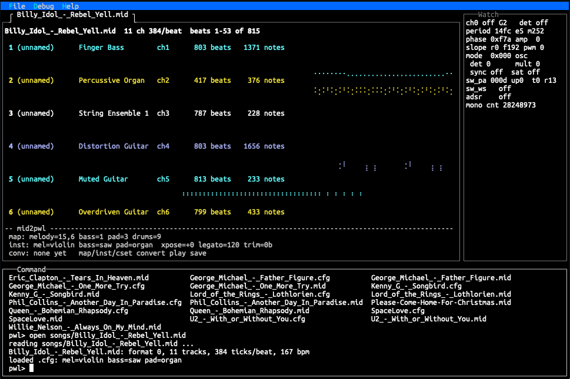

# pwl-tui — a music workstation for the TinyQV PWL synth

By Ken Pettit, August 2026.

Open permissive license ... use freely. No warantees provided :)

`pwl-tui` turns the **PiecewiseOrionSynth** (peripheral 33 on the
Tiny Tapeout *TT Sky 25a* "Asteroids" tapeout, by Toivo Henningsson) into a
playable instrument: a full-screen terminal UI running **on the chip itself**,
with demo songs, a MIDI-file converter, a sound-design studio, and a host
filesystem so your songs and patches live on your PC.

The synth is 4 voices of piecewise-linear oscillator with hardware sweeps.
On top of that, this firmware adds ADSR envelopes, pitch envelopes (scoops
and slides), timbre envelopes (bow bite, bell strikes), vibrato, legato
slurring, and a chord arpeggiator — enough to make a saxophone scoop, a
piano decay, or tubular bells ring.

[](PWL-TUI.png)

---

## 1. What you need

**Hardware**

- A [Tiny Tapeout demo board](https://tinytapeout.com) with the
  **TT Sky 25a** chip (the tool selects design 495 by default; use
  `--design` for other tapeouts).
- The **QSPI Flash + RAM PMOD** in the chip's PMOD socket — the firmware
  runs from this flash and uses its RAM.
- Something to hear it with: the **Tiny Tapeout Audio PMOD** on the output
  PMOD, or your own filter/amp on `uo[7]` (left; `uo[6]` becomes right when
  you enable stereo). The output is 1 MHz PWM — any RC filter + amplified
  speaker works.
- A USB cable to the demo board.

**Software**

- **Python 3.8+**. `tqv.py` (included) has **no dependencies** — pure
  standard library, talking straight to the board's USB serial port.
- macOS or Linux work out of the box. **Windows needs WSL** — see
  [section 4](#4-windows-notes).

---

## 2. Quick start: flash it and hear something

Clone the repo (the SDK submodule is optional unless you build from source):

```sh
git clone https://github.com/kdp1965/pwl-tui.git
cd pwl-tui
```

Plug in the demo board and program the prebuilt firmware into the QSPI
flash:

```sh
./tqv.py flash prebuilt/pwl_tui.bin
```

Alternately you can use Michael Bell's browser based interface to flash your
board:  https://program.tinyqv.com

`flash` writes the image, verifies it, starts the design, and attaches your
terminal to the chip's console. After a moment you'll see:

```
PWL synth CLI (PiecewiseOrionSynth, peripheral 33 at 08000640)
type 'help' for commands
pwl>
```

You are now typing at a RISC-V CPU on the tapeout. Try:

```
pwl> demo 16
```

…and Skybells should come out of the speaker. Any key stops a demo.

**Console keys to remember**

| Key | Effect |
|---|---|
| `Ctrl-]` | Detach `tqv.py`, **leaving the design running** |
| `Ctrl-Q` then `q` | Stop the design and exit |

**The other tqv.py commands**

| Command | What it does |
|---|---|
| `./tqv.py flash <bin>` | Program QSPI flash, start the design, attach the console |
| `./tqv.py run` | Restart whatever is already in flash (fresh boot), attach |
| `./tqv.py console` | Attach to a running design **without resetting it** |
| `./tqv.py reset` | Stop the design, hand the board back to its MicroPython REPL |
| `./tqv.py info` | Report the board's firmware + flash chip (note: this stops the design) |

If the port isn't auto-detected (it looks for `/dev/cu.usbmodem*` and
`/dev/ttyACM*`), pass `--port /dev/ttyACM0` or set `TQV_PORT`.

---

## 3. The tqvfs host filesystem

The chip has no SD card — instead, while `tqv.py` is attached, it quietly
**serves a directory of your PC to the firmware** over the same serial
console. The firmware's `fopen`/`fgets`/`fprintf` reach across the wire, so
"files" on the synth are really files on your machine.

- The served root is the **`tqvfs/` directory next to `tqv.py`**
  (override with `--fs-root DIR`, disable with `--no-fs`).
- `tqvfs/songs/` holds MIDI files, converted songs, and their settings.
- The TUI's own state lives there too: `tui.cfg` (window layout, command
  history), `studio.rec` (your studio sounds), `song.studio` (studio
  recordings).

Drop a `.mid` file into `tqvfs/songs/` on your PC and it is instantly
visible to `ls` and `open` on the chip. Songs you `save` appear on your PC.

Two things worth knowing:

- **Filesystem errors are silent by design** (the firmware also runs on
  consoles with no file service). If files mysteriously "don't exist",
  check that `tqv.py` is attached — a detached console means no
  filesystem.
- Detach with `Ctrl-]` only when the prompt is idle. Detaching while a
  file is being read or written strands the operation.

At the `pwl>` prompt, `fs` checks the link:

```
pwl> fs
host fs: tqvfs 1 tqvfs
```

---

## 4. Windows notes

`tqv.py` uses Unix terminal APIs (`termios`), so it **does not run under
native Windows Python**. The good news: it should run perfectly in **WSL2**,
which is a few minutes of one-time setup (I didn't actually try it as I
don't own a Windows machine and haven't for 23 years).  So this is all
just Fable 5's directions:

1. Install WSL (PowerShell as admin): `wsl --install` (Ubuntu by default),
   then reboot.
2. Install [usbipd-win](https://github.com/dorssel/usbipd-win) — this
   bridges USB devices into WSL:
   ```powershell
   winget install usbipd
   ```
3. Plug in the demo board, then in an **admin** PowerShell:
   ```powershell
   usbipd list                     # find the board's BUSID (e.g. 2-3)
   usbipd bind --busid 2-3         # one-time
   usbipd attach --wsl --busid 2-3 # each time you plug it in
   ```
4. Inside WSL the board appears as `/dev/ttyACM0`. You may need to be in
   the `dialout` group (`sudo usermod -a -G dialout $USER`, then re-open
   the terminal).
5. Clone and run from the WSL shell exactly as in section 2
   (`python3 tqv.py flash ...` if `./tqv.py` isn't executable).

Use **Windows Terminal** for the WSL shell — the TUI is a full-screen
VT100 application and needs a real terminal emulator. Give it a large
window (see below).

---

## 5. The demos

At the `pwl>` prompt: `demo <n>` (add `q` to skip the note display, e.g.
`demo 7 q`). Any key stops playback.

| # | Demo | What it shows |
|---|---|---|
| 1 | Waveform tour | The same phrase in each oscillator preset |
| 2 | Chord fade + power sting | Detuned chord swell, hardware amp sweeps |
| 3 | Four-channel groove | Drums + bass + lead on the eighth grid |
| 4 | Für Elise | Two-pass arrangement (sine, then organ + NES bass) |
| 5 | Jungle adventure | Percussion recipes and effects |
| 6 | Sunburst Run | Full 4-voice original song (~95 s) |
| 7 | Another Day in Paradise | MIDI conversion, vocal mix + ADSR (~4:50) |
| 8 | " (lead-vocal mix) | Same song, no envelopes — hear the difference |
| 9 | Axel F | MIDI reduction (~3:00) |
| 10 | Axel F + ADSR | Same, with envelopes |
| 11 | gmlast | One piano track split SATB across all 4 voices (~2:50) |
| 12 | Slipstream | Pitch + timbre envelope showcase (~47 s) |
| 13 | Always On My Mind | Vocal scoops + ADSR (~3:35) |
| 14 | Flute & bells | Pan flute, then 3-channel **tubular bells** (~22 s) |
| 15 | Adagio | The violin instrument: bow, slide, vibrato (~23 s) |
| 16 | Skybells | Everything at once: instrument switches mid-channel, envelopes, vibrato, layered bells (~46 s) |

---

## 6. The TUI

The plain `pwl>` prompt is fine for demos, but the real cockpit is the
full-screen UI:

```
pwl> tui
```

**Terminal size matters.** The TUI adapts, but the Studio tab wants ~40+
rows and the MIDI views enjoy width — a maximized terminal (50×120 or
more) is the comfortable experience.

The screen has three areas:

- **Source window** (top left) — tabs: the splash screen, the **Studio**
  instrument panel, **Notes** (live per-voice note tracks while songs
  play), and one tab per opened MIDI file.
- **Watch window** (top right) — live registers of one synth voice
  (`watch 0`–`watch 3` selects). Knob turns and envelopes show up here in
  real time.
- **Command window** (bottom) — the `pwl>` prompt with history (arrow
  keys) and **tab completion** (commands, filenames, instrument names).

`help` lists every command a page at a time; `help <cmd>` explains one.
`Ctrl-W` moves keyboard focus between the command window and the source
window (the Studio tab takes over the keys when focused — see section 8).
`close` closes the active tab; `exit` returns to the plain console.

---

## 7. Playing MIDI files

This is the heart of the tool: turn a General MIDI file into a 4-voice
arrangement, interactively, *while listening*.

### Open and explore

```
pwl> open songs/Axel-F.mid          (tab completion works: open so<TAB>)
```

The file opens in its own tab showing its tracks and channels. Now find
out what each MIDI channel actually is by **soloing it**:

```
pwl> play ch3            listen to channel 3 (default: sine)
pwl> play ch3 piano      ...as piano
pwl> play ch9            the drum channel plays as percussion
```

Any key stops. This is how you decide which channel deserves which of the
four voices.  You can scroll through the channels using CTRL-F and CTRL-B
to move Forward Backward and ALT-R / ALT-L to move right/left.  CTRL-T will
move between different Tabs and CTRL-W will change the focus of the active
window region.

### Map channels to roles

The converter reduces the MIDI onto four roles: **melody** (voice 2),
**bass** (voice 0), **pad** (voice 1, chords reduced or arpeggiated), and
**drums** (voice 3, kick/snare/hat one-shots).

```
pwl> automap             guess the mapping from the MIDI itself
pwl> map                 show it
pwl> map melody 4        melody from MIDI channel 4
pwl> map melody +3       ...and let channel 3 fill melody's rests
pwl> map melody -3       remove it again
pwl> map bass 1
pwl> map pad off
pwl> map satb 0          special: split ONE piano-style channel across
                         all four voices (soprano/alto/tenor/bass)
```

`automap` prints its reasoning per channel — a good starting point that
you then override by ear.

### Choose instruments

```
pwl> inst                       list instruments
pwl> inst melody sax
pwl> inst bass saw
pwl> inst pad organ
pwl> inst ch3 piano             pin an instrument to a MIDI CHANNEL:
                                notes from ch3 play as piano even when
                                they land on the melody voice as fills
pwl> inst ch3 off               back to the role's instrument
```

Instruments: `sine saw organ tri nes square pulse25 pulse12 clamp orion
smooth violin panflute bells piano sax`. The last five are fully
articulated — the violin bows and blooms vibrato, the piano decays to
silence like a struck string, the sax tongues phrase starts, **slurs**
fast runs on one breath, and scoops into notes.

### Balance and shape

```
pwl> amp ch7 50%         mix: MIDI channel 7 at half volume wherever
                         its notes land (great for taming fills)
pwl> cset legato 200     gaps under 200 ms tie notes together (and give
                         slurring instruments longer slurred runs)
pwl> cset xpose -2       transpose the whole song
pwl> cset arp 40         PAD ARPEGGIATOR: the pad voice cycles its
                         chord tones every 40 ms — one voice fakes a
                         chord, C64-style (0 = off)
pwl> trim 16             cut the first 16 beats (long intros)
pwl> adsr / penv / vib   per-voice envelope overrides (see 'help')
```

### Convert, listen, save

```
pwl> convert             build the sequence (shows event count/length)
pwl> play                hear the whole arrangement (any key stops)
pwl> save songs/axel.pwl compact binary you can 'play' any time
pwl> save songs/axel.c   C source, to compile into the firmware as a demo
```

**Every setting autosaves** to a `.cfg` next to the `.mid`
(`songs/Axel-F.cfg` — plain text, safe to hand-edit). Reopening the file
restores your whole mix: mapping, instruments, gains, envelopes,
everything. To get started, drop any General MIDI file into
`tqvfs/songs/` on your PC — it's visible to `open` immediately, no
transfer step needed.

---

## 8. The Studio tab

`studio` opens the instrument workbench: every parameter of one voice as
a front panel — waveform slopes, PWM, detune, full ADSR, pitch envelope,
timbre envelope, vibrato — with live register feedback in the watch
window.

Press **Ctrl-W** until the source window highlights: now your keyboard
plays the panel.

**The knobs**

| Key | Action |
|---|---|
| `Up`/`Down` | Select a parameter row |
| `Left`/`Right` | Adjust it (applies immediately, audibly) |
| `<` / `>` | Coarse adjust |
| `0`–`3` | Switch which synth voice you're editing |

**Playing it**

| Key | Action |
|---|---|
| `SPACE` | Gate the note on/off (hold-style) |
| `p` | Play one note (in timed mode, for the Duration setting) |
| `n` | Toggle continuous / timed note mode |
| `a`–`g`, `#` | Pick the pitch (letters + sharp) |
| `+` / `-` | Octave up / down |
| `s` | Silence everything |

**Sounds — your patch list.** The `sounds:` line below the panel is a
numbered list of saved patches, kept in `tqvfs/studio.rec` (plain text)
and restored every boot:

| Key | Action |
|---|---|
| `r` | Record the current panel as a new sound |
| `u` | Update the selected sound in place |
| `,` / `.` (or `h` / `l`) | Select previous/next — **and apply it**, even to a ringing note |
| `[` / `]` | Reorder the list |
| `X` | Delete the selected sound |

A `*` after the filename means an autosave is pending (it lands a couple
of seconds after you stop editing).

**The song recorder.** The `song:` line records *performances* — your
keystrokes with their timing, including sound switches mid-note:

| Key | Action |
|---|---|
| `R` | Start/stop recording (asks append/overwrite if a take exists) |
| `P` | Replay the take / stop replaying |

Takes save to `tqvfs/song.studio` as readable text. Since sound picks are
recorded as *list positions*, reordering your sounds re-orchestrates a
recorded song — a feature, not a bug.

---

## 9. Building from source

Only needed if you change the firmware; otherwise use `prebuilt/`.

You need the TinyQV RISC-V toolchain (default expected at `/opt/tinyQV`;
override with `RISCV_TOOLCHAIN=...`). Then:

```sh
git clone --recurse-submodules https://github.com/kpettit-kii/pwl-tui.git
cd pwl-tui
make                       # builds the SDK submodule on demand, links pwl_tui.bin
./tqv.py flash pwl_tui.bin
```

The `tinyQV-sdk` submodule is fetched automatically by the Makefile if
missing. `make clean` removes all build products.

**Repo map:** firmware sources at the top level (`main.c` = CLI + demos +
sequencer, `pwl_synth.c` = the driver, `tui/` = the curses UI,
`song_*.c` = demo songs), `tools/mid2pwl.py` = the same MIDI converter as
a host-side tool, `tqvfs/` = the served filesystem, `tqv.py` = the board
tool.

---

## 10. Troubleshooting

- **"no board found"** — pass `--port` (WSL: did you `usbipd attach`?).
- **Commands answer with Python errors** — the design isn't running (the
  board is at its MicroPython REPL). `./tqv.py run` restarts it.
- **`cat`/`open` say "cannot open"** — the host filesystem isn't
  attached. Check `fs`; reattach with `./tqv.py console`.
- **The TUI looks garbled or cramped** — use a real terminal emulator
  (Windows Terminal, iTerm2, GNOME Terminal), maximize it, and start
  `tui` *after* resizing.
- **A demo/`play` won't stop** — press any key in the console; if you
  detached, `./tqv.py console` reattaches without resetting.
